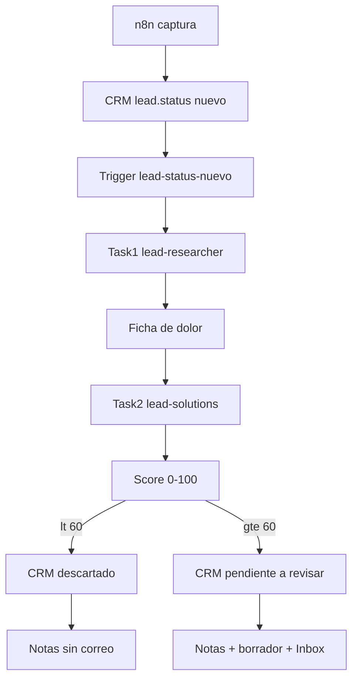

# Lead Intake — workflow de producto (doc only)

**Status:** Planned — **solo documentación. No implementar ahora.**

Segundo workflow de producto encima de AgentOS: un lead en estado CRM `nuevo` dispara una plantilla de 2 pasos. Un agente investiga dolores; otro puntúa, escribe notas/estado en el CRM y deja el abordaje del primer contacto. El correo **no se envía** hasta que el operador configure la plantilla y apruebe en Inbox.

Calendario: [ROADMAP.md](../ROADMAP.md). Sketch Phase 2+: [PHASE2_PLUS.md](../agentos/PHASE2_PLUS.md). Templates / Inbox: [CONTROL_PLANE_NAV.md](CONTROL_PLANE_NAV.md). Mapa Phase 1: [AGENTOS.md](AGENTOS.md).

| Etiqueta | Valor |
|----------|--------|
| **Fases de implementación** | 3 (template + seeds) + 5 (trigger) |
| **Dependencia dura** | Fase 2 Isolation / Connections (`crm`, luego `mail`) |
| **Non-goal Phase 1** | No hay Lead en SQLAlchemy; no hay template instantiate ni webhook |

---

## 1. Job del operador

Cuando entra un lead en estado **`nuevo`**, el sistema:

1. Investiga sus dolores y deja una **ficha de dolor** reutilizable.
2. Un segundo agente propone **soluciones en las notas del lead**, aplica un **score** y escribe el **estado CRM** según umbral.
3. Si el score califica, deja un **borrador de primer contacto** (plantilla del operador, aún por configurar).

El humano no vigila el run: solo interviene en Inbox para el contacto (o bloqueos).

## 2. Qué no es

- No es un CRM dentro de GallaAI (no hay tabla `leads`).
- No es el workflow de 9 pasos `compound-engineer-workflow`.
- No es un Goal / gauntlet loop.
- No es envío automático de correo.
- No es chat con el lead.
- No mezcla estados CRM (`descartado`, `pendiente a revisar`) con columnas Kanban (`todo` → `done`).

## 3. Fuente de verdad del lead

El lead vive **fuera** de AgentOS. AgentOS solo guarda Task + Session + artefactos.

| Dato | Dónde |
|------|--------|
| Identidad, estado `nuevo` / `descartado` / `pendiente a revisar`, notas, email | CRM (Connection `crm`; vendor no hardcodeado) |
| Alta / captura (estado inicial) | **n8n** (pipeline externo; JSON fuera de este repo) |
| Orquestación | AgentOS: trigger → template → 2 sessions |
| Ficha de dolor | Attachment / artefacto de la task 1 |
| Borrador de correo | Attachment de la task 2 + Inbox; **no** se envía en v1 |

### Ingreso (n8n)

El workflow **n8n** de captura/alta es el pipeline upstream del CRM. Contrato fijado: **todos** los leads que ingresan se escriben (o se fuerzan) con estado CRM **`nuevo`**. El JSON de n8n **no** se versiona en GallaAI; solo este contrato.

Plantilla de mail y vendor CRM quedan como TODO de configuración del operador, no como bloqueo para este spec.

---

## 4. Flujo

```text
n8n (captura)  →  CRM: lead.status = nuevo
        │
        ▼
Trigger lead-status-nuevo  ── instanciar template lead-intake-workflow
        │
        ├─ Card 1  lead-researcher     session A
        │     investiga dolores
        │     persiste Ficha de dolor
        │     marca done  →  desbloquea card 2
        │
        └─ Card 2  lead-solutions      session B
              lee la ficha
              emite { score, rubrica, razon }
              control plane aplica umbral → PATCH estado CRM
              append notas del lead
              si score >= 60: borrador / aviso plantilla + Inbox
              deja card en review (gate)
                    │
                    ▼
              Humano marca done
```



---

## 5. Trigger — `lead-status-nuevo`

**Fase:** 5.

- Evento: alta con estado `nuevo` (garantizado por n8n en el ingreso; no un filtro ad hoc de “si por casualidad viene nuevo”).
- Idempotencia: un `leadId` no instancia dos veces la plantilla mientras haya un run abierto o `done` reciente.
- Payload al crear las tasks: `lead_id`, nombre, empresa, email, origen, notas actuales, URL CRM.
- Secreto inválido del webhook → 401 (mismo criterio Phase 5).

Mientras no exista Fase 5: el operador puede crear las 2 tasks a mano. El trigger espera a Phase 5.

---

## 6. Template `lead-intake-workflow`

**Fase:** 3. Variable típica: `leadId` (análoga a `branchName` en compound-engineer).

| # | Task | Agente | Gate | Done when |
|---|------|--------|------|-----------|
| 1 | Investigar dolores | `lead-researcher` | no | Existe **Ficha de dolor** válida y la card pasa a `done` |
| 2 | Soluciones + score + primer contacto | `lead-solutions` | **sí** | Notas (+ estado CRM) escritos; Inbox si aplica; solo el humano marca `done` |

La card 2 **no arranca** hasta que la 1 esté `done`. El token de sesión del agente **no** puede `PATCH done` en el paso gated.

---

## 7. Seed `lead-researcher`

**One job:** investigar dolores del lead y persistir la ficha. No escribe notas CRM. No calcula score de corte. No redacta el correo. No spawnea al segundo agente (lo hace el scheduler de la plantilla).

**MCPs previstos (Fase 2, default deny):** `agentos`, `inbox`, `crm` (lectura), búsqueda/web si hay Connection granted.

**Ficha de dolor** (artefacto estructurado; no chat libre):

```text
# Ficha de dolor — {lead_name} / {company}
lead_id:
origen:
fecha:

## Identidad
## Dolores (rankeados)
- dolor | evidencia | confianza (alta/media/baja)
## Contexto (empresa, rol, industria)
## Datos que faltan
## Preguntas de descubrimiento (máx. 5)
## Qué no afirmar
```

Si no hay evidencia: ficha con hipótesis débiles + “datos que faltan”. No inventar dolores. Si el CRM no tiene email/empresa mínimos: Inbox de bloqueo; **no** desbloquear card 2.

---

## 8. Seed `lead-solutions`

**One job:** leer la ficha → emitir score → (control plane escribe estado CRM) → append notas → si `>= 60`, rellenar plantilla de primer contacto o avisar que falta. No investiga de nuevo. No envía el correo.

**MCPs previstos:** `agentos`, `inbox`, `crm` (append notas + write de estado acotado a `descartado` \| `pendiente a revisar`), `mail` solo cuando exista plantilla **y** el humano haya aprobado (fuera de v1).

### 8.1 Score y transición de estado (CRM)

Regla **cerrada:**

| Score | Estado CRM | Correo / Inbox |
|-------|------------|----------------|
| **&lt; 60** | `descartado` | Notas con el porqué. **Sin** borrador de primer contacto. Inbox solo si falla el append/PATCH. |
| **&gt;= 60** (incluye **60**) | `pendiente a revisar` | Notas + borrador (o “plantilla pendiente”) + Inbox para el humano. |

Estos estados son del **CRM**, no columnas Kanban. La task 2 sigue `review` hasta que el humano marca `done`.

**Quién aplica el umbral:** el agente emite `{ score, rubrica, razon }`. El **control plane** aplica el corte y hace el `PATCH` de estado. El LLM no elige estado a ojo. Si el agente pide un estado que no coincide con el score → se ignora y se registra en el tool-event log.

**Rúbrica mínima (0–100), a partir de la ficha:**

| Criterio | Peso |
|----------|------|
| Dolor claro y evidenciado | 0–30 |
| Fit con la oferta | 0–25 |
| Datos suficientes para contactar (email, rol, empresa) | 0–20 |
| Urgencia / timing | 0–15 |
| Señales en contra (fuera de ICP, spam, empresa fantasma) | −25 a 0, o 0–10 positivo |

### 8.2 Notas del lead (append-only)

```text
[AgentOS lead-intake {session_id} {ISO-8601}]
Dolores: …
Soluciones propuestas: …
Ángulo de primer contacto: …
Ficha: {link o id de task 1}
Score: {0-100}
Banda: descartado | pendiente a revisar
Estado CRM escrito: descartado | pendiente a revisar
Correo: no_aplica | plantilla_pendiente | borrador_listo | no_enviar
```

No borrar notas humanas. Si el append o el PATCH de estado fallan → Inbox, card en `review`; **no** fingir el cambio.

---

## 9. Plantilla de correo — aún por configurar

Pieza **del operador**, no del agente. Hasta que exista, en banda `>= 60` el paso 2:

1. Escribe soluciones y estado en notas.
2. Deja en Inbox: “Plantilla de primer contacto no configurada. Soluciones listas en notas.”
3. No inventa un email de marca.

Cuando se configure (Knowledge o Connection `mail`), placeholders mínimos:

| Placeholder | Origen |
|-------------|--------|
| `{{nombre}}` | CRM |
| `{{empresa}}` | CRM |
| `{{dolor_principal}}` | Ficha |
| `{{solucion}}` | Salida de `lead-solutions` |
| `{{cta}}` | Plantilla del operador |
| `{{firma}}` | Plantilla del operador |

**Abordaje del primer contacto (v1):**

- Tono: humano, concreto, un dolor + una vía; no pitch genérico.
- Canal: email; no LinkedIn/WhatsApp en este workflow.
- **Nunca auto-send.** Envío = write confirmado: Inbox → operador aprueba.
- En banda `descartado`: `Correo: no_aplica` (no se rellena plantilla).

---

## 10. Inbox (dónde entra el humano)

| Situación | Inbox |
|-----------|--------|
| Lead sin datos mínimos | Bloqueo en card 1 |
| Score &lt; 60, notas/estado OK | No (salvo error CRM) |
| Score &gt;= 60, plantilla de mail ausente | Aviso; notas y estado sí se escribieron |
| Score &gt;= 60, borrador listo | Pregunta: aprobar / editar / no enviar |
| Fallo CRM al escribir notas o estado | Error + no marcar done |

Progreso rutinario → activity de la task, no Inbox.

---

## 11. Seeds a documentar (no añadir a `seeds.py` ahora)

| Seed | One job | MCP | Collaboration |
|------|---------|-----|----------------|
| `lead-researcher` | Investigar dolores → ficha | `agentos`, `inbox`, `crm` (read) | no spawnea |
| `lead-solutions` | Ficha → score → notas + estado CRM (+ borrador si `>= 60`) | `agentos`, `inbox`, `crm` (notes + status write) | no spawnea |

Prompts **RECONSTRUCTED** / originales de GallaAI. No mezclar con los de Postma. No tocar [CONTRACT.md](../agentos/CONTRACT.md) ni Phase 1 seeds hasta implementar.

---

## 12. Dependencias

| Fase | Por qué bloquea este feature |
|------|------------------------------|
| 2 Isolation + Connections | Grants `crm` / `mail`; default deny |
| 3 Templates + gates | Cadena 2 cards; gate en paso 2 |
| 5 Triggers | Evento `nuevo` → instantiate |
| Knowledge (2+) | Archivo de plantilla de correo |
| Gmail/HubSpot nativos | Preferir MCP nativo si existe; no duplicar con Zapier |

Phase 1 no puede ejecutarlo de verdad: no hay template instantiate, ni webhook, ni CRM.

---

## 13. Done when (cuando se implemente)

1. Un evento de prueba `status=nuevo` crea exactamente **2 cards** ligadas al mismo `leadId`.
2. Tras session 1: la ficha está en la task; card 2 sigue bloqueada hasta `done` de la 1.
3. Lead de prueba con score **47** → CRM `descartado`, notas con banda, **sin** borrador.
4. Lead de prueba con score **60** o **81** → CRM `pendiente a revisar`, notas + Inbox (borrador o “plantilla pendiente”).
5. El agente no puede marcar `done` el paso 2.
6. El mismo `leadId` no duplica el workflow si ya hay run abierto.
7. Un estado CRM pedido por el LLM que no coincida con el score se ignora (política en control plane).

---

## 14. Non-goals (v1)

- Envío automático de email / secuencias
- Scoring, cadencia, SLA comercial más allá del umbral 60
- Chat con el lead
- CRUD de leads en GallaAI
- Más de 2 agentes en la cadena
- LinkedIn/WhatsApp
- Usar Zapier si hay MCP nativo del mismo CRM
- El agente elige estado sin score, o envía mail a un `descartado`
- Umbrales extra (`caliente`, `ganado`, etc.)

---

## 15. Criterio de “documentado de verdad”

1. Job del operador — §1  
2. Qué **no** es — §2  
3. Fase en [ROADMAP.md](../ROADMAP.md) — § header + §12  
4. Dependencias — §12  
5. Done when — §13  
6. Non-goal — §14  
